<h1 align="center">🚗 Motor Vehicle Insurance Premium Prediction</h1>

<p align="center">
  <strong>Regression Modeling • Data Preparation • Ethical ML • Hyperparameter Tuning</strong><br>
  Ridge • Lasso • KNN • Baseline Model • MAE Evaluation
</p>

<p align="center">
  
  
  
  
</p>

---

## 📝 Project Overview

This project builds and evaluates machine learning regression models to predict **motor vehicle insurance premiums** using real-world insurance customer data.  
The dataset contains 53,502 records with a wide range of vehicle, policy, and claims information.

The goals of this project are to:

- Train regression models to predict **net premium amount**
- Compare models using **Mean Absolute Error (MAE)**
- Evaluate business impact, risks, and fairness
- Produce interpretable and ethically responsible models

Models implemented:

- **Dummy Regressor (Baseline)**
- **Ridge Regression**
- **Lasso Regression**
- **K-Nearest Neighbors (KNN)**

---

## 💼 Business Use Case

Insurance companies rely on premium prediction to support:

### **Pricing Automation**

Automatically generate fair and competitive quotes for new customers.

### **Revenue Forecasting**

Estimate total premium revenue for financial planning.

### **Customer Retention**

Prevent overpricing or underpricing that leads to customer dissatisfaction or risk exposure.

### **Fair and Transparent Decision-Making**

Support underwriters and actuaries with interpretable models.

**Primary Stakeholders:**

- Insurance company management
- Underwriters & actuaries
- Sales & customer service teams
- Customers (indirectly)

---

## 📂 Repository Structure

```bash
├── datasets
│   ├── car_insurance_premium_testing.csv
│   ├── car_insurance_premium_training.csv
│   └── car_insurance_premium_validation.csv
├── figures
├── notebooks
│   ├── 1_EDA.ipynb
│   ├── 2_Preparation.ipynb
│   ├── 3_Baseline.ipynb
│   ├── 4_Experiment_Ridge.ipynb
│   ├── 5_Experiment_Lasso.ipynb
│   └── 6_Experiment_KNN.ipynb
└── README.md
```

---

## 🔍 Notebook Descriptions

### **1. EDA Notebook**

- Defines business use case & stakeholders
- Performs exploratory data analysis
- Reviews distributions, anomalies, missing data
- Visualizes vehicle, policy, and claims features

---

### **2. Preparation Notebook**

- Cleans missing and invalid data
- Removes sensitive and leakage-related features (gender, age, names, renewal dates, etc.)
- Feature engineering:
  - `driving_experience_years`
  - `years_since_last_renewal`
- Encodes categorical variables
- Feature selection using Pearson & Chi-square
- Applies StandardScaler
- Outputs train/validation/test sets

---

### **3. Baseline Notebook**

- Implements Dummy Regressor
- Computes MAE as baseline
- Sets minimum acceptable model performance

---

### **4. Experiment 1 – Ridge Regression**

- Trains Ridge models across multiple alpha values
- Evaluates performance on train/val/test sets
- Analyses multicollinearity
- Recommends next steps

---

### **5. Experiment 2 – Lasso Regression**

- Trains Lasso models with different alpha values
- Shows sparsity and feature elimination
- Compares results with Ridge
- Highlights interpretability benefits

---

### **6. Experiment 3 – KNN Regression**

- Trains KNN models varying:
  - `n_neighbors`
  - distance metric `p`
- Analyses overfitting and local pattern performance
- Identifies best hyperparameter combination
- Notes limitations for extreme premium values

---

## 📊 Project Visualisations

This project includes a comprehensive set of visualisations that appear across three stages of the pipeline:  
**EDA → Preparation → Model Experiments**.

---

# 1. 🔍 Exploratory Data Analysis (EDA)

The EDA notebook (`1_EDA.ipynb`) contains all feature-level exploratory plots to understand the dataset’s structure, identify skewness, detect outliers, and explore variable relationships.

---

### 📌 Numerical Feature Distributions

**1. Distribution of `net_premium_amount`**  
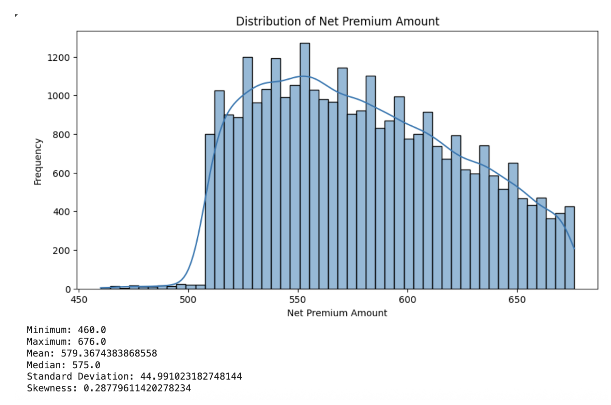

**2. Distribution of `vehicle_value`**  
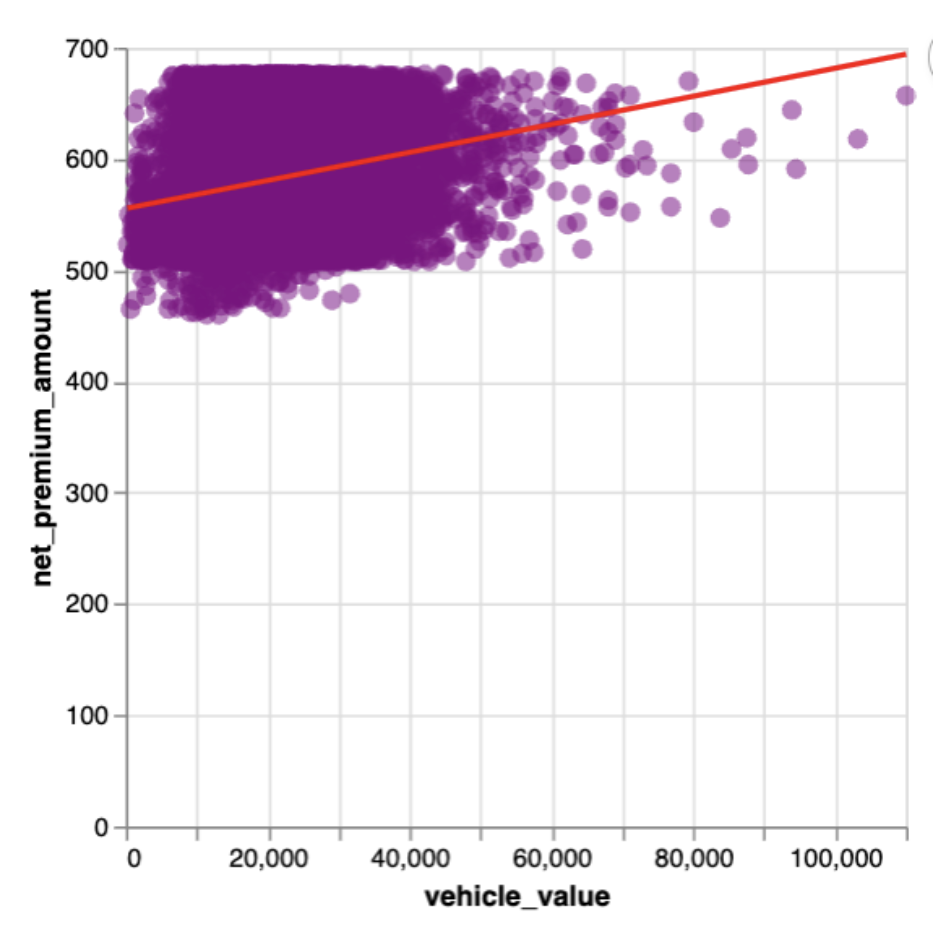

**3. Distribution of `vehicle_horsepower`**  
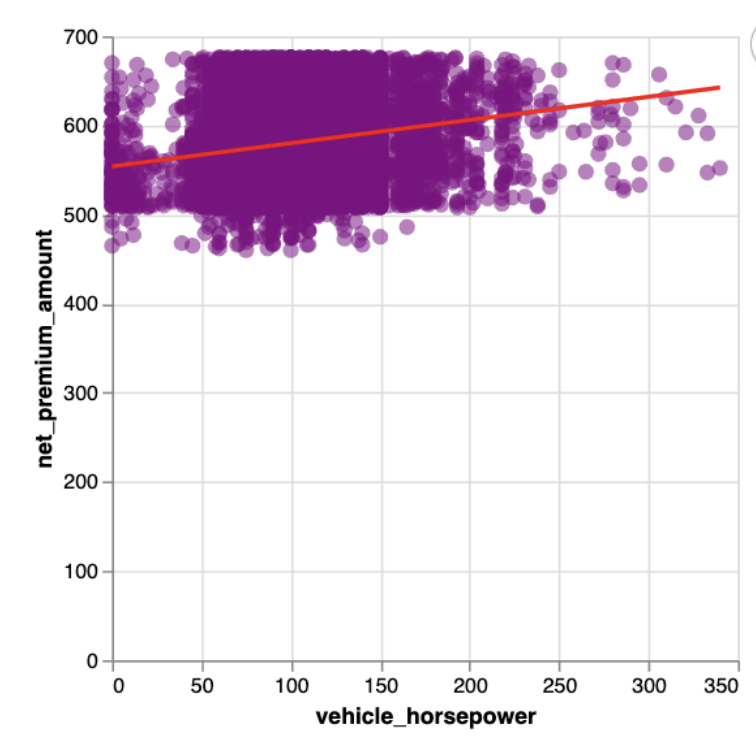

**4. Distribution of `Vehicle_cylinder`**  


**5. Distribution of `Current_Policies_Held`**  
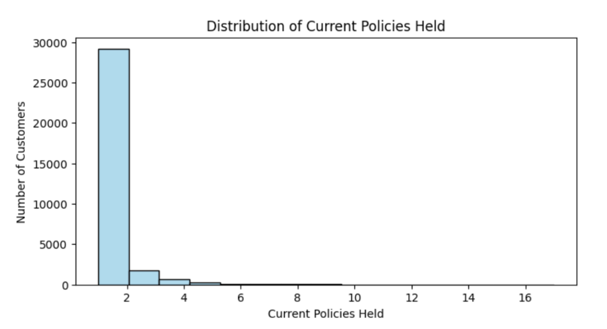

**6. Distribution of `Max_Policies_Held`**  
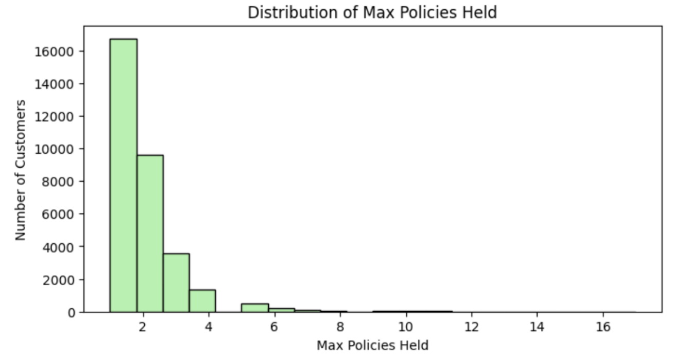

**7. Distribution of `Max_Products_Held`**  
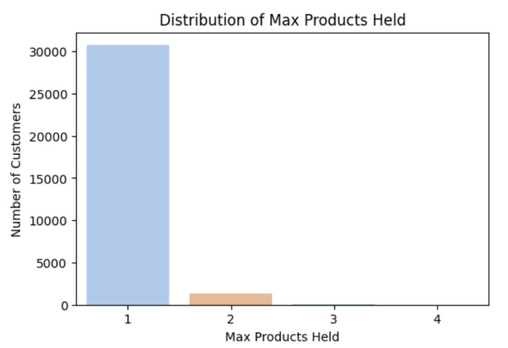

**8. Distribution of `Seniority`**  
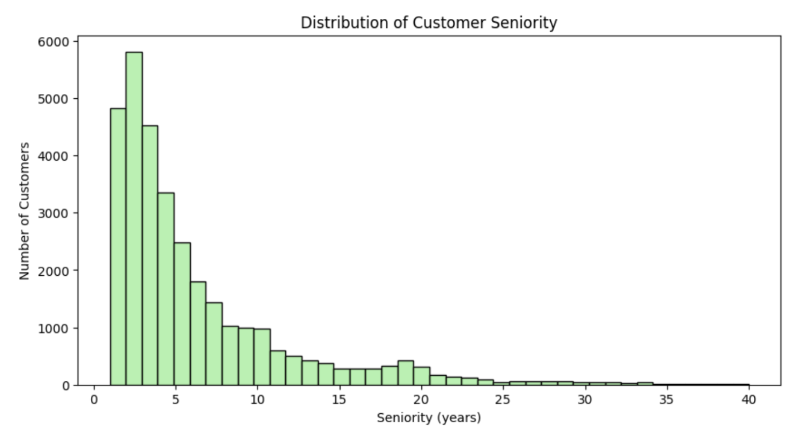

**9. Distribution of `total_claims_number_in_history`**  
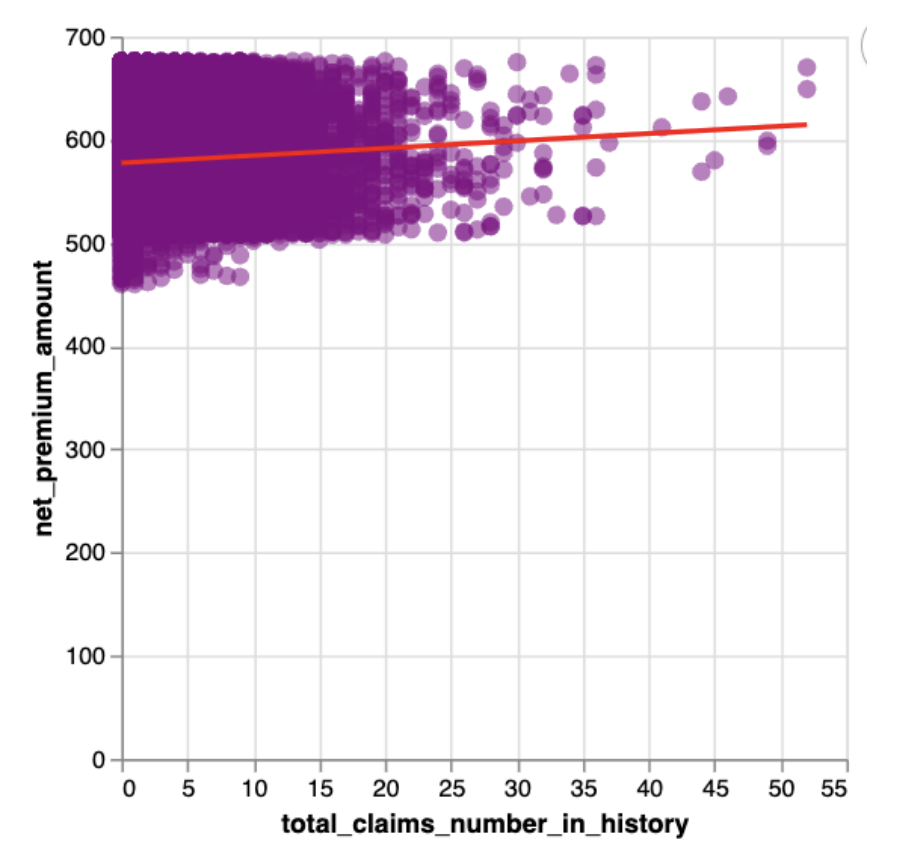

---

### 📌 Box Plots (Outlier Detection)

**1. Box plot — `vehicle_horsepower`**  
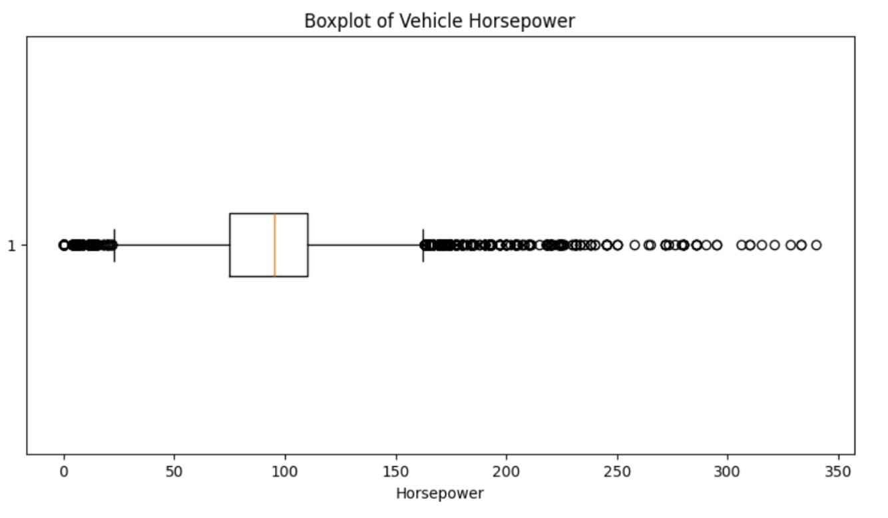

**2. Box plot — `Vehicle_cylinder`**  


**3. Box plot — `total_claims_number_in_history`**  
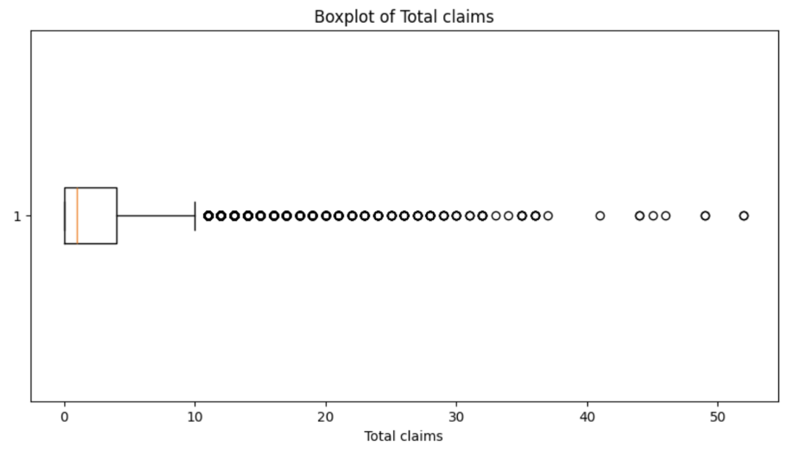

---

### 📌 Categorical Feature Visualisations

**1. Bar chart — `vehicle_doors`**  
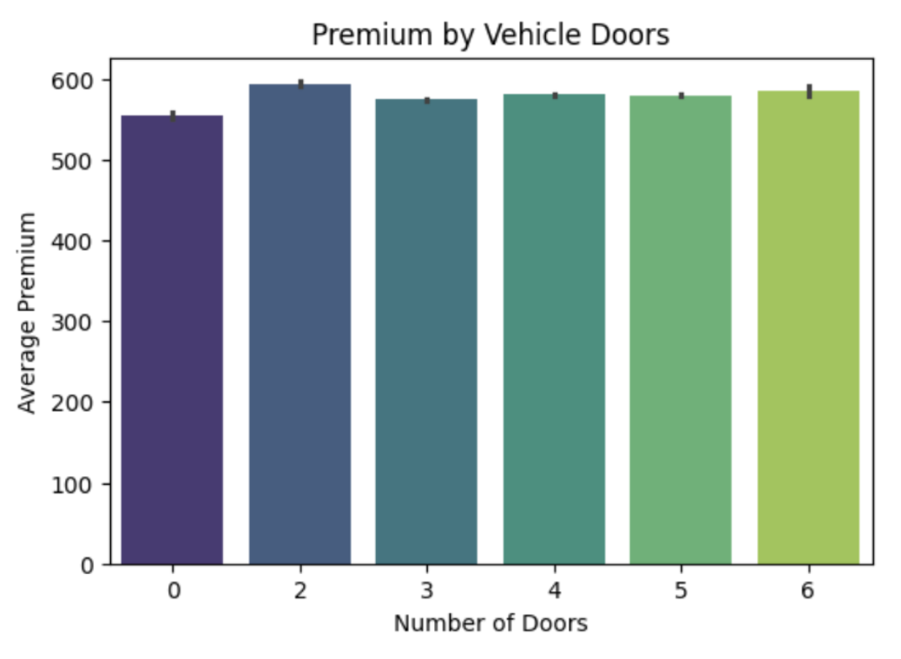

**2. Bar chart — `total_claims_cost_in_current_year`**  
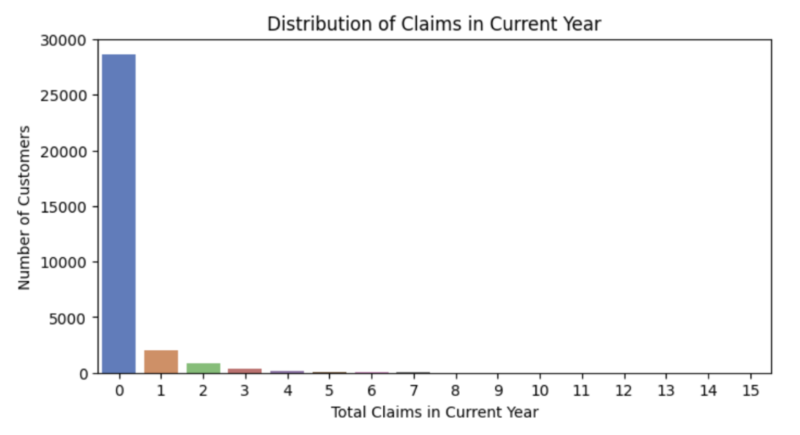

**3. Bar chart — `second_driver`**  
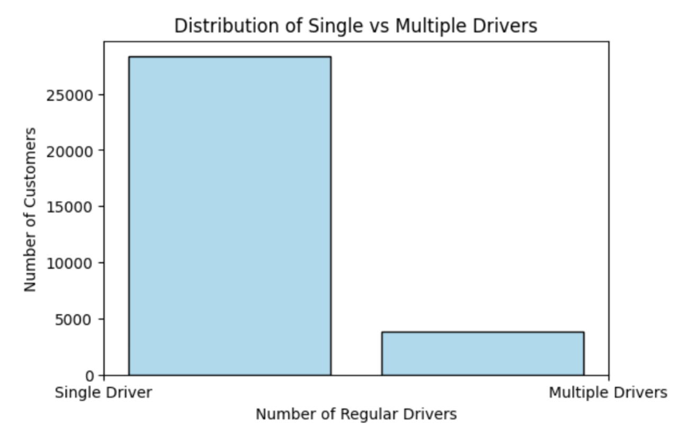

---

### 📌 Feature Relationships to Premium

**1. Vehicle length vs premium**  
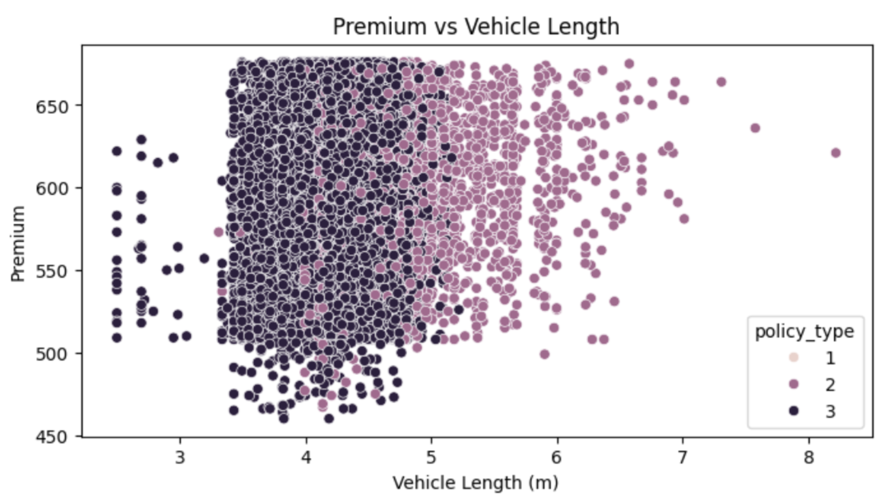

**2. Vehicle weight vs premium**  
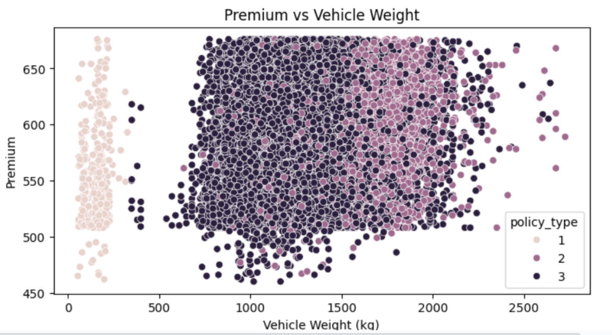

---

# 2. 🧹 Data Preparation

The preparation notebook (`2_Preparation.ipynb`) includes a detailed analysis of multicollinearity.

### **Correlation Heatmap**

This visual highlights linear feature relationships and guides model selection  
(e.g., regularised models such as Ridge and Lasso).

<br>
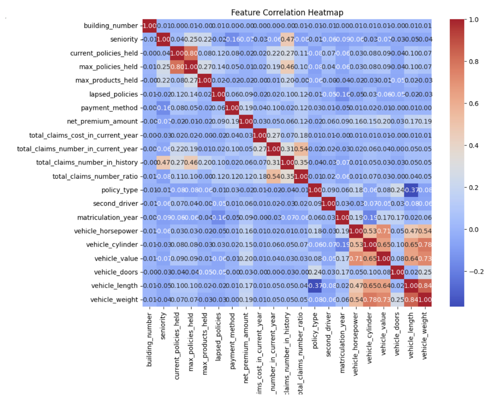

---

# 3. 🤖 KNN Regression Experiment

The KNN experiment notebook (`6_Experiment_KNN.ipynb`) evaluates the performance of a tuned K-Nearest Neighbors regression model.

### **KNN Actual vs Predicted**

This comparison plot shows predicted vs true premium values.  
Points closer to the diagonal represent better prediction quality.

<br>


---

## 📈 Model Performance Summary

| Model                | Validation MAE | Test MAE   | Notes                                      |
| -------------------- | -------------- | ---------- | ------------------------------------------ |
| **Baseline (Mean)**  | —              | **232**    | Minimum performance benchmark              |
| **Ridge Regression** | ~132           | **219.52** | Stable but slightly underfits              |
| **Lasso Regression** | ~132           | **219.52** | Similar to Ridge, more interpretable       |
| **KNN Regression**   | **130.57**     | **218.85** | Best validation MAE, weaker generalization |

**All models improved on the baseline**, but all show **systematic underestimation** of premium values.

---

## ⚖️ Ethical Considerations

The dataset includes personally identifiable information (PII) and protected characteristics.  
The following were **excluded** to avoid bias:

- First and last name
- Prefix
- Age & birth date
- Gender
- Address fields
- Email & phone number
- Payment dates and renewal dates (leakage risk)

Reasons for exclusion:

- Ethical fairness
- Privacy protection
- Prevent regulatory violations (e.g., EU gender directive)
- Avoid discriminatory pricing

---

## ▶️ How to Run the Project

### 1. Clone the repo

```bash
git clone https://github.com/<your-username>/<repo-name>.git
cd <repo-name>
```

### 2. Install dependencies

```bash
pip install -r requirements.txt
```

### 3. Launch the notebooks

```bash
jupyter notebook
```

### 4. Run notebooks in order

1. 1_EDA.ipynb

2. 2_Preparation.ipynb

3. 3_Baseline.ipynb

4. 4_Experiment_Ridge.ipynb

5. 5_Experiment_Lasso.ipynb

6. 6_Experiment_KNN.ipynb

### 🧾 Final Conclusions

All models outperform the baseline, confirming predictive value in the dataset

KNN shows strongest validation performance but weak generalization

Ridge & Lasso are more stable but still underestimate premiums

More advanced models or richer features (e.g., driving behaviour) are required for deployment-level accuracy

Ethical and unbiased modeling was maintained by excluding sensitive features
